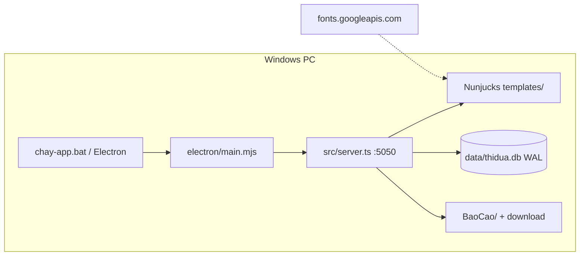
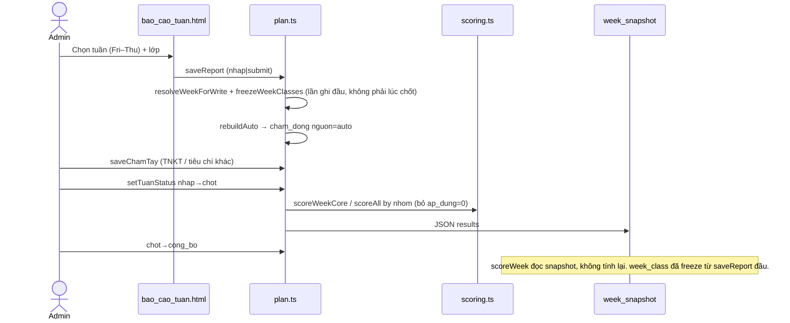
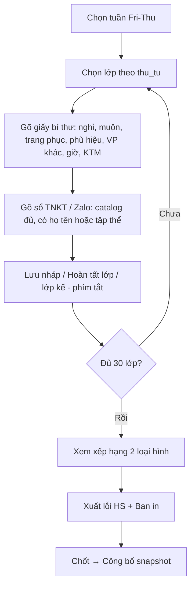
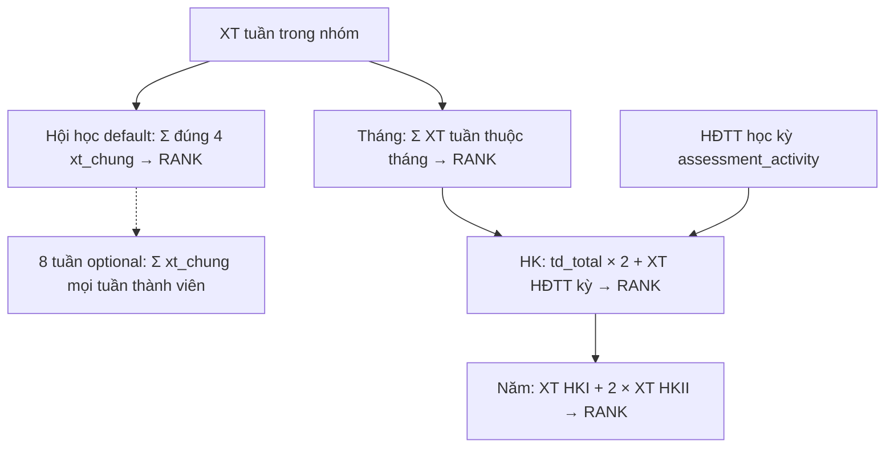
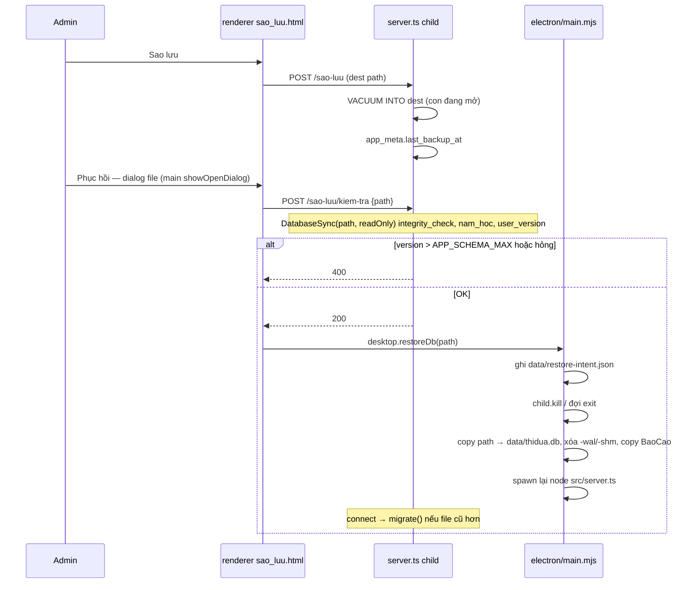
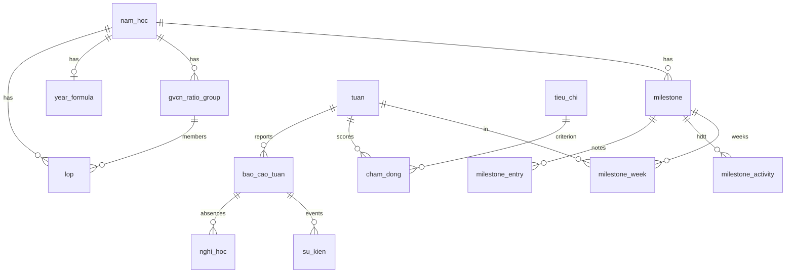

# Thi đua Chi đoàn THPT Giao Thủy C — Thiết kế triển khai trên codebase hiện có

| Trường | Giá trị |
| --- | --- |
| Tài liệu | Design + PR plan (không phải rewrite greenfield) |
| Ứng dụng | Quản lý thi đua chi đoàn, THPT Giao Thủy C |
| Repo | `e:\ThiDuaGTC` (clone https://github.com/dmhung1508/QuanLyThiDua.git, commit `b3b8480`) |
| Tác giả | Grok (design subagent) |
| Ngày | 2026-09-16 (sửa sau review) |
| Trạng thái | Draft |
| Đối tượng | Kỹ sư triển khai PR theo từng lát; BCH Đoàn trường đọc phần quyết định / câu hỏi mở |

---

## Overview

Ứng dụng TypeScript hiện tại (`src/server.ts` + SQLite `data/thidua.db` + Electron) đã có lịch tuần Thứ Sáu–Thứ Năm, nhập báo cáo, chấm bổ sung, chốt/công bố snapshot, xếp hạng theo `lop.nhom`, tổng hợp tháng/kỳ/năm, và pipeline xuất Excel/Word. Nó **chưa** khớp năm học 2026–2027 của nhà trường: seed lớp vẫn là roster 2025–2026 (không có 10D1–10D4, `nhom` lớp chọn sai), UX còn ám chỉ bí thư “gửi báo cáo” online, công thức học kỳ chưa nhân 2 theo Word, mô hình GVCN là tỷ lệ Excel cũ chứ không phải 20 điểm của *Công tác chủ nhiệm*, chưa có hội học / mốc 8 tuần, chưa có bảng lỗi học sinh theo lớp, bản in tuần chưa bám layout Ban in.

Hướng đi: **giữ** Express 5 + Nunjucks + `node:sqlite` + Electron, bọc máy đơn Windows, bind `127.0.0.1:5050`. **Sửa** công thức / roster / copy admin-only / xuất Ban in. **Thêm** mốc hội học (Σ 4 tuần; 8 tuần optional), quy đổi GVCN 20 điểm, xuất lỗi HS, sao lưu USB, font offline. **Xóa** dual-stack Python (Tkinter/Flask) và template Flask chết. Không đưa cloud, không multi-user, không bắt internet.

Quy mô: ~30 lớp, ~1308 HS, ~35–40 tuần/năm, giữ 2 năm lịch sử local. File SQLite kỳ vọng **< 50 MB**. Một người vận hành trên một máy Windows.

---

## Background & Motivation

### Hiện trạng kỹ thuật

| Lớp | File / điểm vào | Vai trò |
| --- | --- | --- |
| Desktop | `e:\ThiDuaGTC\electron\main.mjs`, `chay-app.bat`, `desktop.cmd` | Spawn `node --experimental-strip-types src/server.ts`, `DESKTOP=1`, cửa sổ Electron 1400×900 |
| HTTP local | `e:\ThiDuaGTC\src\server.ts` `startServer()` | Express 5, cookie flash, Nunjucks, **chỉ** `127.0.0.1` |
| DB | `e:\ThiDuaGTC\src\db.ts` | `DatabaseSync`, WAL, `THIDUA_DB_PATH` hoặc `data/thidua.db` |
| Lịch + workflow tuần | `e:\ThiDuaGTC\src\plan.ts` | `weekFilter`, `saveReport`, `saveChamTay`, `setTuanStatus` (`nhap`/`chot`/`cong_bo`), `scoreWeek` |
| Công thức tuần | `e:\ThiDuaGTC\src\scoring.ts` | `tbNn`, `tbGio`, `tbKtm`, `scoreAll` theo `nhom` |
| Tổng hợp kỳ | `e:\ThiDuaGTC\src\periods.ts` | `periodTable` tháng / nửa / HK / năm; 2 model `monthly` \| `halves` |
| Thi + HĐTT | `e:\ThiDuaGTC\src\assessments.ts` | `examResults`, `activityResults` (văn nghệ / thể thao) |
| GVCN | `e:\ThiDuaGTC\src\conduct.ts` | Tỷ lệ từng lớp (`classic` / `teacher`) — **không** khớp Word chủ nhiệm |
| Xuất | `workbook-export.ts`, `docx-export.ts`, `class-report-export.ts`, `report-export.ts`, `report-data.ts` | Excel generic, Word báo cáo chi đoàn, print |
| Seed | `e:\ThiDuaGTC\src\seed.json` | Roster **cũ** 30 lớp, phù hiệu giả −10 |
| Test | `e:\ThiDuaGTC\tests\report-workflow.test.ts` | 23 test workflow / lịch / snapshot / export |
| Python leftover | `quanlythidua/*.py`, `run.py`, `requirements.txt` | Tkinter + Flask; `__main__.py` / `run.py` chỉ spawn Node |

Python `tb_ktm` (`quanlythidua/scoring.py`) chia cho `ktm_ge5 + ktm_lt5` — cùng ý với TypeScript `tbKtm()` chia cho tổng 5 dải (gồm 5–6 trọng số 0).

### Đau điểm nghiệp vụ

1. **Admin nhập tất cả** từ nhiều nguồn (sổ TNKT, Zalo, giấy bí thư, GVCN) nhưng UI nói “Gửi báo cáo” / “Đã gửi” như thể bí thư nộp online.
2. Hai đường thi đua **lớp chọn / lớp thường** phải xếp **trong nhóm**, không trộn toàn trường — skeleton `scoreAll` đã làm, nhưng flag `nhom` trong seed **sai** so với `CT - GVCN + Sỹ số lớp.xlsx`.
3. Giáo viên cần xuất **bảng lỗi HS theo lớp** (một workbook, sort lớp rồi HS) — chưa có.
4. Mốc **hội học tháng 11 / tháng 3** (Excel: cộng dồn 4 XT tuần; giáo viên nói nhân đôi hoạt động — OQ5) chưa là first-class object. “8 tuần” không có trong Word 2026 (OQ7).
5. Cuối kỳ/năm: quy đổi thi đua → **điểm công tác chủ nhiệm 20 điểm** theo 3 nhóm ngưỡng A/B/C + thưởng hạng tuần + lỗi nặng. `conduct.ts` đang dùng tỷ lệ Excel 2016–2018.
6. Trường **không có server**, không cloud. `base.html` vẫn kéo Google Fonts.

---

## Goals & Non-Goals

### Goals

- Công cụ **admin-only, máy đơn, offline**: nhập → tính → chốt → xuất.
- Roster 2026–2027 (30 lớp, 1308 HS, 7 lớp chọn, 10D1–10D4, GVCN, sĩ số) là dữ liệu, không hard-code tên lớp trong công thức.
- Công thức tuần / tháng / kỳ / năm bám *Đánh giá thi đua 2026–2027.doc*, có test đối chiếu Ban in tuần 10 (2025–2026) khi cùng giả định.
- Hội học (4 tuần) cấu hình được trên lịch năm; mốc 8 tuần **ẩn** cho đến khi BCH tạo (OQ7).
- GVCN 20 điểm theo *5.CÔNG TÁC CHỦ NHIỆM.doc*, nhóm tỷ lệ **cấu hình theo năm**.
- Xuất: (a) lỗi HS theo lớp, (b) Ban in tuần, (c) hội học / tháng / kỳ / năm / GVCN.
- Sao lưu / phục hồi `data/thidua.db` trên Windows (đóng SQLite trước khi copy) và thư mục `BaoCao`.
- Retire Python; một runtime TypeScript.

### Non-Goals

- Không portal bí thư / học sinh, không tài khoản, không RBAC, không mật khẩu mạng.
- Không Postgres / Firebase / sync cloud / hosting.
- Không rewrite Express/Nunjucks/Electron.
- Không dual-maintain Tkinter/Flask.
- Không tự bịa mapping nhóm A/B/C chủ nhiệm 2026–2027 hay chính sách nhân đôi hội học — xem OQ1, OQ5. Default hội học = Σ 4 XT tuần (`hoi_hoc_double='none'`), khớp Excel 2025–2026, **không** nhân HĐTT cho đến khi BCH trả lời.
- Không bắt PIN/khóa cửa sổ trong 10 PR này (chay.bat mở browser localhost; khóa cửa sổ Electron không khóa dữ liệu).
- Không OCR sổ TNKT / import Zalo tự động (admin gõ).
- Không tính “hạ bậc rèn luyện cá nhân sau 5 lỗi / −30 điểm” thành điểm lớp (chỉ ghi chú trên tiêu chí).

---

## Key Decisions

1. **Giữ stack Electron + Express local + SQLite WAL.** Rationale: đã có workflow chốt/snapshot/test; rewrite không giải gap nghiệp vụ.

2. **Không identity hệ thống, không PIN trong 10 PR này.** `chay.bat` mở `http://127.0.0.1:5050` bằng browser hệ thống (không Electron). PIN cửa sổ Electron không khóa file SQLite — theater, không data lock. USB vật lý là kiểm soát thật. PIN cửa sổ (nếu cần) là phase sau.

3. **`lop.nhom` = đường thi đua; `loai_hinh` là nhãn đồng bộ, một input.** UI select **Lớp chọn / Lớp thường** ghi cả hai: `chon` ⇒ `nhom=1`, `thuong` ⇒ `nhom=2`. Ranking (`scoreAll`, `periodTable`, `activityResults`) vẫn group `nhom`. Ban in group `loai_hinh` rồi `thu_tu`. Banner `/lop` và `/ket-qua-tuan` nếu tồn tại hàng `(nhom=1) <> (loai_hinh='chon')`. Nhóm A/B/C chủ nhiệm là bảng **khác** (`gvcn_ratio_group`) — không hard-code tên lớp.

4. **Mẫu số TB KTM mặc định = số lượt điểm (Ban in), không phải sĩ số (Word).** `year_formula.ktm_divisor` = `count` \| `si_so`. Fixture tuần 10 **không** dùng seed 2026–2027 (KD 16). OQ3.

5. **Phù hiệu giả 2026–2027 = −30/HS.** UPDATE cả `tieu_chi.ma='phu_hieu_gia'` và dòng `quy_che` tương ứng. Tuần `trang_thai='nhap'`: `rebuildAuto` lấy `diem` mới. Snapshot `chot`/`cong_bo` giữ `diem_mot` đã đóng băng. OQ4.

6. **Hội học = đúng 4 tuần Fri–Thu giao tháng 11 / tháng 3** (admin chọn). **Không** gán sẵn `calendar_no` 7–10: với `ngay_bd=2026-09-01`, tuần 7 rơi giữa tháng 10, không phải 20/11. Tạo sẵn hàng `milestone` rỗng `ma IN ('20-11','26-3')` lúc tạo năm; **không** gán `milestone_week` cho đến khi admin xác nhận. Excel 2025–2026 T7–T10 / T27–T30 chỉ là ví dụ năm cũ.

7. **Hội học official mặc định `hoi_hoc_double='none'`:** `tong = Σ xt_chung` của đúng 4 tuần thành viên, rồi `RANK(tong, asc)` trong `nhom`. Khớp sheet `20-11-2025` (không cột HĐTT, không ×2). Enum chỉ `none` \| `hdtt_only` \| `week_xt`. **`week_points` bỏ** — `RANK(2·tb)=RANK(tb)` nên hạng giống `none` (cùng bệnh `week_xt`). `week_xt` giữ làm display-only, UI cảnh báo rank-invariant. HĐTT đợt → `milestone_activity`. OQ5.

8. **Học kỳ `monthly` 2026–2027:** `total = td_total * year_formula.hk_month_weight + xt_hdtt` với `hk_month_weight` default **2**, `xt_hdtt` từ `assessment_activity` kỳ `'1'|'2'` (không đổi CHECK). Official: đủ mọi tháng của HK, else `xt=null`. Preview: ×2 trên tổng tháng đã có (giữ `complete_count` hiện tại). `include_exam` **đã** default 0 — ẩn checkbox sau `<details>` mẫu 2016. Model `halves` ẩn mặc định.

9. **GVCN 20 điểm — thuật toán (không hard-code tên lớp).**
   - **Tập tuần = `tuan.nam_hoc_id` + `hoc_ky` + `included=1`** (cùng `periodTable` / `monthsOf`). WEEK3 seed có `included=0` → **không** vào 5.1/5.2, không làm `diem=null` dù nút xóa mẫu chưa bấm.
   - **5.1 cửa sổ (OQ6):** default `gvcn_5_1_window='semester'` — `floor(Σ penalty_nguong_w / nguong)*0.1` trên tổng các tuần *trong tập trên* (gồm tuần có override). Nhánh `'weekly'`: mỗi tuần `floor(penalty_nguong_w/nguong)*0.1` rồi cộng.
   - **Lỗi nặng thay thế** — §7. Override: `penalty_nguong_w = override.penalty`, `tru_nang_w = 0` (bỏ ánh xạ sự kiện); **vẫn cộng vào** `Σ` 5.1.
   - **Thưởng 5.2:** mọi tuần *trong tập `included=1`* có `xt_chung` official, gồm hội học. 1224: mọi lớp `xt_chung∈{1,2,3}` nhận 0.5/0.3/0.2.
   - Official `diem=null` chỉ khi tập `included=1` còn tuần chưa `cong_bo` (hoặc `gvcn_group_id` NULL). Preview: tính trên tuần đã công bố.

10. **Vi phạm có tên: một đường ghi điểm.** Nếu `su_kien.tieu_chi_id` khác NULL → `rebuildAuto` chỉ cộng tiêu chí đó; `loai` lưu `tieu_chi.score_key` (hoặc `'vp'`). Không cộng thêm theo `loai` cùng hàng. Prefix giấy (`nghi`/`di_muon`/…) không mang `tieu_chi_id` — map `ma` như hiện tại. `ho_ten` bắt buộc trừ `tap_the=1`. `su_kien.nguon CHECK IN ('giay','tnkt','tay')`. `loi_vi_pham` không dùng phía TS.

11. **Xuất Ban in = `ban-in-export.ts` riêng; xuất lỗi HS = `GET /xuat/loi-hs` riêng.** Không nhét `loi_hs`/`ban_in` vào `ExportRequest.scope`. Không ALTER CHECK `period_entry.mode`. Kỷ luật/khen hội học → `milestone_entry`. `/khen` thêm `hoi_hoc:{id}` / `tam_ket:{id}`.

12. **Seed mới chỉ khi DB trống. Lớp thừa không xóa — `lop.ap_dung=0`.** Leftover tên: `10A7, 10A9, 10A10`. `listLop(con, namId, { activeOnly = true })`: cohort / picker / `periodTable` / GVCN / assessments / `freezeWeekClasses` dùng `activeOnly: true` (sau freeze: `week_class.ap_dung=1`). **`GET /lop` và banner import: `activeOnly: false`** để hiện lớp inactive + toggle áp dụng. Nút “Xóa tuần mẫu”: `ghi_chu` khớp chuỗi seed; **xóa tay** bảng không CASCADE (`week_snapshot`, `week_status_log`, `week_class`, `weekly_legacy_input`, `manual_score_conflict`) rồi `DELETE FROM tuan` (FK CASCADE chỉ có trên `diem_tuan` / `bao_cao_tuan` / `cham_dong`). Không ALTER FK lịch sử. WEEK3 `included=0` đã vô hại với GVCN/tháng nếu nút không bấm.

13. **Retire Python** trong PR 1: xóa `quanlythidua/*.py`, `run.py`, `requirements.txt`; giữ `templates/` + `static/`. Giữ `POST /quy-che/luu` và `POST /quy-che/:id/xoa` (alias). Xóa `tao_tuan` khỏi `render.ts` ROUTES. Lối vào: `npm start` / `chay-app.bat` / `chay.bat`.

14. **Offline + backup Windows.** Gỡ Google Fonts. Backup: Express `VACUUM INTO` khi `con` mở. **Restore không đi IPC từ child:** renderer/main chọn file → POST `/sao-luu/kiem-tra` (Express mở ứng viên **read-only**) → `desktop.restoreDb(path)` → **main** ghi `restore-intent.json`, kill child, copy `.db`, xóa `-wal`/`-shm`, copy `BaoCao`, respawn. `chay.bat`: không `window.desktop` → UI chỉ hướng dẫn copy thủ công. `app_meta` v10. Reject `user_version` file > `APP_SCHEMA_MAX`.

15. **`user_version` = thứ tự merge PR, mỗi PR tự chứa DDL nó cần.** Migrator idempotent (`addColumn`, `CREATE IF NOT EXISTS`). Không tuyên bố PR độc lập schema. Map: **v5 PR2** roster/`loai_hinh`/`ap_dung` + backup `.before-v5.db`; **v6 PR3** `year_formula` + UPDATE `phu_hieu_gia` −30; **v7 PR4** cột `su_kien`; **v8 PR6** `milestone*`; **v9 PR8** `gvcn_ratio_group`; **v10 PR9** `app_meta`. Hook `user_version < 1` trong `connect()` **không** cover v5 — code mới `VACUUM INTO` tại bước v5.

16. **Fixture Ban in tuần 10 = năm in-memory riêng, không phải seed 2026–2027.** Sĩ số/nhóm 2025–2026 (11A1=47, 11A2=44, 14 lớp NÂNG CAO gồm 10A4/6/8, 10A3 cơ bản, không 10D*). PR 3 **không** phụ thuộc roster PR 2 cho test này.

17. **Freeze `week_class` lúc ghi đầu tiên** (giữ `freezeWeekClasses` hiện tại + test). Không dời sang `nhap→chot`. Roster import: `UPDATE week_class` chỉ tuần `trang_thai='nhap'` từ `lop` hiện tại; **không** đụng `chot`/`cong_bo`. Thêm cột `thu_tu`, `loai_hinh`, `gvcn_group_id`, `ap_dung` và backfill cả hàng đã freeze. Tuần đã công bố giữ `nhom` cũ — đúng.

18. **8 tuần không có trong Word 2026–2027.** Không tạo `milestone.ma='tam_ket'` sẵn. Nav/trang ẩn cho đến khi admin tạo (OQ7). Nếu tạo: `tong = Σ xt_chung` **mọi tuần thành viên** (không phải `xt_dot_20_11 + xt_dot_26_3`). Nếu admin đánh `nguon_tuan='union'`: membership = hợp tuần của `20-11` ∪ `26-3`, **tự cập nhật** khi sửa hội học.

19. **`LOI_MAU` không phải runtime TS** — generate từ `tieu_chi` hoặc xóa khỏi `scoring.ts` ở PR 3. Thêm `tieu_chi` `gio_kem` (−2) vào SEED `plan.ts`; thêm `xe_dap_de_sai_tap_the` −10.

---

## Current architecture (as-is)



Luồng tuần hiện tại:



`diem_tuan` vẫn tạo ở `initDb` seed mẫu tuần 3 nhưng workflow chính đọc `bao_cao_tuan` + `cham_dong` (`buildWeekInputs`). `loi_vi_pham` có trong `SCHEMA` `db.ts` nhưng **không có** reader/writer TypeScript (chỉ Python `db.py`).

---

## Gap analysis — KEEP / CHANGE / ADD / DELETE

### KEEP (không vứt)

| Thành phần | Chi tiết |
| --- | --- |
| Runtime | Express 5, Nunjucks, `cookie-parser`, `node:sqlite` `DatabaseSync`, Electron 44 |
| Bind | `127.0.0.1` trong `startServer` |
| Lịch | `weekFilter` / `resolveWeekForWrite` / `schoolCalendar` — tuần ảo, không ghi khi chỉ xem; Fri–Thu; tháng theo thứ Sáu |
| Workflow khóa | `nhap` → `chot` → `cong_bo`; `week_snapshot`; `week_class` freeze **lúc ghi đầu** (`saveReport`/`saveChamTay`); revision optimistic lock |
| Xếp nhóm | `scoreAll` + `competitionRanks` kiểu 1224 (hòa cùng hạng, hạng sau = số người trước + 1). Ban in tuần 10 NÂNG CAO: 4 lớp TB NN = 0 → XT NN = 1, lớp kế XT = 5 — khớp 1224 **trong loại hình** |
| TB nề nếp | `tbNn = diemNn / si_so` — khớp Word §I.a |
| TB giờ | `tbGio = diemGio / soGio`, trọng số Tốt +2, Khá +1, TB 0, Yếu −1, Kém −2 — khớp catalog 2026–2027 và `formulas.html` |
| Period building blocks | `period_month`, `period_options`, official vs preview, “thiếu 1 lớp → cả nhóm chờ” |
| Năm | `XT_nam = XT_HKI + 2 * XT_HKII` trong `periodTable` mode `nam` — khớp Word §II.e |
| HĐTT | `assessment_activity.the_thao` + `van_nghe` |
| Export class Word | `buildClassReport` + `classReportDocx` (mẫu giấy bí thư) |
| Test harness | `report-workflow.test.ts` — lịch không ghi, snapshot immutable, revision 409. **Từng PR sửa assertion** mà nó đổi hành vi; không đóng băng 23 test ở PR 10. |
| WAL backup-on-v1 | `VACUUM INTO` `*.before-workflow-v1.db` khi `user_version < 1` — **không** chạy lại ở v5 (install thật đã = 4). Backup v5 là code mới. |

### CHANGE

| Mục | Hiện tại | Đích |
| --- | --- | --- |
| Copy UX | “Báo cáo tuần”, “Gửi báo cáo”, “Đã gửi”, nav bí thư-centric | Admin nhập từ giấy/sổ; nút **Lưu nháp** / **Hoàn tất lớp**; `bao_cao_tuan.trang_thai` giữ `nhap`/`da_gui` nội bộ, label “Nháp / Đã nhập đủ” |
| Roster seed | `seed.json`: 10A3 = nhom 2; 10A4/6/8 = nhom 1; không 10D*; có 10A7/10A9/10A10; sĩ số 2025–2026; không GVCN | 30 lớp xlsx 2026–2027; lớp thừa `ap_dung=0` (không xóa) |
| `lop.html` | “Nhóm (1/2)” số trần | Select **Lớp chọn / Lớp thường** ghi `loai_hinh`+`nhom`; cột GVCN, nữ, KT, thứ tự, áp dụng |
| `tbKtm` | Chia tổng 5 dải — **khớp Ban in, lệch Word** | Default `count`; toggle `si_so`; fixture năm 2025–2026 in-memory |
| `phu_hieu_gia` | `plan.ts` SEED / `LOI_MAU` / `NN_COLS` / `quy_che` −10 | −30 trên `tieu_chi` **và** `quy_che`; tuần mở rebuild; snapshot giữ |
| `NN_COLS` label | “giả −10” | “giả −30” |
| HK monthly | `periods.ts` ~L268: `rank_td * (halves ? 2 : 1) + HĐTT` | `td_total * hk_month_weight + xt_hdtt`; official đủ tháng; preview nhân trên phần có |
| `formulas.html` | Đối chiếu TUAN 3.xls / mẫu 2016–2018 | Công thức 2026–2027 + OQ1,3–7 |
| `conduct.ts` | `20 + TRUNC(−tổng / ratio) * 0.1` | 20 điểm Word; 5.1 default **tổng HK**; lỗi nặng **thay** 30/50 |
| Nav `base.html` | “Nề nếp GVCN”, “Báo cáo tuần” | “Nhập tuần”, “Công tác chủ nhiệm”, “Hội học”, “Sao lưu”; 8 tuần ẩn đến khi có `tam_ket` |
| Google Fonts | `base.html` L7–8 | Xóa; stack hệ thống `app.css` |
| `initPlan` `user_version` | Gán 4 rồi if-check 3, 1, 2 (chết) | `src/migrate.ts` v5→v10 **theo thứ tự PR** |
| `listLop` | `ORDER BY nhom, thu_tu, ten` | `listLop(con, namId, { activeOnly = true })`. Cohort/tính điểm: `true`. `/lop` quản lý leftover: `false`. Sort live `thu_tu, khoi, ten`. Picker tuần freeze: `week_class.thu_tu`. Ranking `nhom` |
| Submit validation | Bắt `bi_thu` + `ngay_lap` khi `submit` (test L314–327) | Hoàn tất = không lỗi parse + (classified == `gio_tong` OR `ghi_chu_gio`) + KTM là số nguyên ≥0 (0 được). Không bắt bí thư, không bắt KTM = sĩ số. **PR 4 sửa test này** |

### ADD

| Mục | Ghi chú |
| --- | --- |
| `lop.nu`, `lop.kt`, `lop.loai_hinh`, `lop.ap_dung` | Xlsx + retire lớp thừa |
| `gvcn_ratio_group` + `lop.gvcn_group_id` | A/B/C; PR 8 / v9 |
| `year_formula` | `ktm_divisor`, `hk_month_weight` default 2, `hoi_hoc_double` default `none`, `gvcn_5_1_window` default `semester` — PR 3 / v6 |
| `milestone` + `milestone_week` + `milestone_entry` + `milestone_activity` | Hội học; 8 tuần optional |
| `su_kien.tap_the`, `gvcn_phat_hien`, `nguon` | Catalog + nguồn xuất |
| `week_class.thu_tu`, `loai_hinh`, `gvcn_group_id`, `ap_dung` | Freeze + sort xuất |
| Export lỗi HS | `violation-export.ts`, route riêng |
| Export Ban in | `ban-in-export.ts`, route riêng, map cột §6(b) |
| UI mốc `/nam-hoc` | Gợi ý tuần giao T11/T3, không auto-gán T7–T10 |
| Trang `/hoi-hoc` | Σ 4 XT tuần; HĐTT chỉ khi enum ≠ `none` |
| Sao lưu `/sao-luu` | Express `VACUUM INTO`; restore: main kill child rồi copy |
| `app_meta` | `last_backup_at`, `schema_max` — PR 9 |
| Fixture tuần 10 | Năm in-memory 2025–2026, không `seed.json` |
| Nạp roster 2026–2027 | Upsert + `ap_dung=0` + xóa tuần mẫu |

### DELETE / retire

| Mục | Lý do |
| --- | --- |
| `quanlythidua/app.py`, `web.py`, `db.py`, `scoring.py`, `conduct.py`, `periods.py`, `assessments.py`, `export.py`, `logic.py`, `workbook_export.py`, `__main__.py`, `__init__.py` | Dual stack |
| `run.py`, `requirements.txt` | Python entry |
| Template chết: `nhap.html`, `tao_tuan.html`, `hocky.html`, `quyche.html` | GET `/quy-che` đã redirect `/tieu-chi`; **giữ POST** `/quy-che/luu` và `/quy-che/:id/xoa` |
| `tao_tuan` trong `render.ts` ROUTES | Không có handler TS |
| Semantics `conduct_ratio` model `classic`/`teacher` như công thức chính | Giữ bảng cho dữ liệu cũ, UI mặc định ẩn “mô hình Excel 2016” |
| Gợi ý multi-user / bí thư login trong copy | Trái constraint |

**Không xóa** `diem_tuan` / `weekly_legacy_input` (đọc dữ liệu cũ). Không xóa `quy_che` (catalog hiển thị).

---

## Proposed Design

### 1. Vai trò sản phẩm

Một người (thầy/cô BCH) mở `chay-app.bat` trên PC phòng Đoàn. Không có user khác. Dữ liệu không rời máy trừ khi admin copy USB.

Luồng tuần mục tiêu:



Nguồn giấy (`Bao cao tuan cua Bi thu.doc`) map sẵn:

| Mục giấy | Lưu |
| --- | --- |
| Nghỉ không lý do (họ tên, ngày) | `nghi_hoc` |
| Đi muộn / trang phục / phù hiệu | `su_kien.loai` hiện có |
| Vi phạm khác | `su_kien` `vp_khac` hoặc `tieu_chi_id` |
| Tổng giờ + Tốt/Khá/TB/Yếu (+ Kém catalog) | `bao_cao_tuan` |
| KTM 9–10 … 0–2 (giấy có cả “Trên TB/Dưới TB”) | 5 dải; `ktm_ge5`/`ktm_lt5` derived |
| Chữ ký bí thư | `bi_thu` (metadata giấy, không phải login) |

TNKT không nằm trên giấy → nhập cùng trang, block “Sổ TNKT / khác”, catalog `tieu_chi`.

### 2. Hai đường thi đua

`scoreAll` đã group `lop.nhom`. Seed 2026–2027:

**Lớp chọn (`nhom=1`, `loai_hinh='chon'`)** — đúng cột Ghi chú xlsx:

`10A1, 10A2, 10A3, 11A1, 11A8, 12A1, 12A2` (7 lớp)

**Lớp thường (`nhom=2`)**: 23 lớp còn lại, gồm `10D1–10D4`.

Khác seed cũ (14 lớp “nâng cao” 2025–2026, 10A3 thường, 10A4/6/8 chọn, có **10A7 / 10A9 / 10A10**, không 10D*). Ban in 2025–2026 label “NÂNG CAO / CƠ BẢN” → UI 2026–2027 **“Lớp chọn / Lớp thường”**.

`upsertLop` và form lớp: một select loại hình ghi `loai_hinh` + `nhom` cùng transaction.

**Freeze:** `freezeWeekClasses` chạy ở `saveReport` / `saveChamTay` / `setTuanStatus` **lần đầu** — nếu `week_class` đã có hàng thì return (code hiện tại, giữ). Cột mới trên `week_class`: `thu_tu`, `loai_hinh`, `gvcn_group_id`, `ap_dung`. Backfill từ `lop` lúc migrate. Import roster: `UPDATE week_class SET ten,nhom,si_so,gvcn,thu_tu,loai_hinh,gvcn_group_id,ap_dung = (SELECT … FROM lop)` **chỉ** `tuan.trang_thai='nhap'`. Tuần `chot`/`cong_bo` và `week_snapshot` không đổi `nhom`/sĩ số.

### 3. Công thức tuần (canonical 2026–2027)

Ký hiệu hàng lớp sau `buildWeekInputs`:

```
diem_nn = Σ NN_KEYS + cong_ne_nep          # signed; vi phạm âm, văn nghệ dương
tb_nn   = diem_nn / si_so                  # Word §I.a
so_gio  = gio_tot+gio_kha+gio_tb+gio_yeu+gio_kem
diem_gio = 2*tot + 1*kha + 0*tb -1*yeu -2*kem
tb_gio  = diem_gio / so_gio                # 0 nếu so_gio=0
diem_ktm = 2*n910 + 1*n78 + 0*n56 -1*n34 -2*n02
n_ktm   = n910+n78+n56+n34+n02             # gồm 5–6
tb_ktm  = diem_ktm / n_ktm                 # mặc định count; OQ3
         hoặc diem_ktm / si_so             # nếu year_formula.ktm_divisor='si_so'
tb_ht   = tb_gio + tb_ktm
xt_nn   = RANK(tb_nn, desc) trong nhom     # 1224
xt_ht   = RANK(tb_ht, desc) trong nhom
tong_xt = xt_nn + xt_ht
xt_chung= RANK(tong_xt, asc) trong nhom
```

`competitionRanks` giữ nguyên. Không xếp mixed toàn trường.

#### Phân tích bắt buộc: TB KTM — Word vs Ban in tuần 10

Word (*Đánh giá thi đua 2026–2027*): *“Lấy tổng điểm chia cho **sĩ số lớp** ra điểm trung bình kiểm tra miệng.”*

Code hiện tại (`src/scoring.ts` `tbKtm`):

```124:127:e:\ThiDuaGTC\src\scoring.ts
export function tbKtm(row: Row): number {
  const n = num(row, "ktm_9_10") + num(row, "ktm_7_8") + num(row, "ktm_5_6") + num(row, "ktm_3_4") + num(row, "ktm_0_2");
  return n > 0 ? diemKtm(row) / n : 0;
}
```

`formulas.html` đã ghi: *TB miệng = (2×9–10 + 7–8 − 3–4 − 2×0–2) / tổng cả 5 dải; 5–6 có trọng số 0 nhưng vẫn thuộc mẫu số.*

Số **Ban in / Ban nhap** `Bang thi dua hoi hoc 2025-2026 TUAN 10.xls`, tuần 10 (tuần hội học):

| Lớp | Sĩ số | 9–10 | 7–8 | ≥5 | <5 | 3–4 | 0–2 | ⇒ n56 | Tổng điểm KTM | TB KTM Excel | `diem/count` | `diem/si_so` |
| --- | ---: | ---: | ---: | ---: | ---: | ---: | ---: | ---: | ---: | ---: | ---: | ---: |
| 11A1 | 47 | 1 | 0 | 1 | 0 | 0 | 0 | 0 | 2 | **2** | 2/1=**2** | 2/47≈0.0426 |
| 11A2 | 44 | 2 | 5 | 15 | 5 | 2 | 3 | 8 | 1 | **0.05** | 1/20=**0.05** | 1/44≈0.0227 |
| 11A3 | 47 | 2 | 1 | 4 | 0 | 0 | 0 | 1 | 5 | **1.25** | 5/4=**1.25** | 5/47≈0.106 |
| 11A4 | 46 | 6 | 8 | 15 | 4 | 3 | 1 | 1 | 15 | **0.78947…** | 15/19=**0.78947** | 15/46≈0.326 |

Mọi hàng kiểm tra: Excel = `tổng điểm KTM / (số lượt miệng)`, **không** chia sĩ số. `ktm_ge5+ktm_lt5` = mẫu số (Python `tb_ktm`).

**Kết luận OQ3:** sổ làm việc nhà trường (Ban in) = **count**. Word 2026–2027 viết **sĩ số**. Đây không phải bug code so với Excel. **Không im lặng đổi sang sĩ số.** Default `count`; UI năm học ghi rõ hai lựa chọn.

**Fixture PR 3** (`tests/scoring-week10.test.ts`): `DatabaseSync(':memory:')`, `nam_hoc.ten='2025-2026-fixture'`, **30 lớp copy từ Ban in** (không đọc `seed.json` 2026–2027):

- NÂNG CAO `nhom=1`: 11A1(47), 11A2(44), 11A3(47), 11A4(46), 11A8(41), 10A1(44), 10A2(42), 10A4(43), 10A6(43), 10A8(42), 12A1(45), 12A2(45), 12A4(44), 12A8(42)
- CƠ BẢN `nhom=2`: 11A5(45), 11A6(46), 11A7(44), 11A9(38), 11A10(41), 10A3(43), 10A5(43), 10A7(43), 10A9(41), 10A10(41), 12A3(45), 12A5(42), 12A6(42), 12A7(44), 12A9(43), 12A10(42)

Assert: (a) `tbKtm` path `count` = 2 / 0.05 / 1.25 / 0.78947 cho 11A1/11A2/11A3/11A4; (b) NÂNG CAO bốn lớp TB NN = 0 → XT NN = 1, lớp kế (12A1 TB ≈ −0.0222) XT NN = **5** (1224); (c) `ktm_divisor='si_so'` ⇒ 11A2 `tb_ktm = 1/44`. PR 3 **không** phụ thuộc seed PR 2 cho file test này.

#### TB giờ vs ô “Tổng điểm giờ học” Excel

Trọng số catalog 2026–2027 và `HT_GIO_COLS` đã đúng. Một số ô “Tổng điểm giờ học” tuần 10 **không** bằng `2*Tốt+Khá−Yếu` (ví dụ 11A2: 28 tốt + 1 khá → 57, ô Excel 55; 11A5: 25+3+1 yếu → 52, ô 44). `formulas.html` đã cảnh báo Ban in cũ **sai dấu KTM 3–4**. Không reverse-engineer numerator lệch thành quy chế. Divisor Excel = số giờ đã xếp loại — khớp `soGio`.

### 4. Tháng, hội học, 8 tuần, kỳ, năm



**Tháng (Word §II.c):** tổng XT tuần trong tháng (lịch hiện tại: tuần tính vào tháng của thứ Sáu; `periodTable` mode `thang` đã SUM rồi RANK). Tháng lịch có thể 4 hoặc 5 tuần Fri–Thu — **khác** hội học cố định 4 tuần. Giữ tháng = mọi tuần `included` có `thang/nam` đó. Không cắt cứng 4 tuần cho “tháng”.

**Hội học:** `milestone.loai='hoi_hoc'`. Lúc `addNamHoc` / migrate: INSERT rỗng `ma IN ('20-11','26-3')` (tên “Hội học 20/11”, “Hội học 26/3”). **Không** INSERT `milestone_week`. UI gợi ý: các tuần Fri–Thu **giao calendar tháng 11 / tháng 3** (`ngay_bd` hoặc `ngay_kt` cắt tháng đó), admin tick đúng 4 tuần. Không dùng `calendar_no` 7–10 làm default 2026.

Official: đủ 4 tuần `trang_thai='cong_bo'` và đủ `xt_chung` trong nhóm, else `xt_dot=null`. Preview: cộng tuần đã có (`complete_count`).

Bảng: cột `xt_chung` từng tuần theo `milestone_week.thu_tu` + `tong` + `xt_dot` + kỷ luật/khen từ **`milestone_entry`** (không `period_entry`). `/khen` thêm option `hoi_hoc:{milestone.id}`.

**HĐTT hội học không dùng `assessment_activity.period`.** CHECK hiện `'1'|'2'|'1-dau'|…`. Thêm:

```sql
CREATE TABLE IF NOT EXISTS milestone_activity (
  milestone_id INTEGER NOT NULL REFERENCES milestone(id) ON DELETE CASCADE,
  lop_id INTEGER NOT NULL REFERENCES lop(id) ON DELETE CASCADE,
  the_thao INTEGER CHECK (the_thao IS NULL OR the_thao >= 1),
  van_nghe INTEGER CHECK (van_nghe IS NULL OR van_nghe >= 1),
  PRIMARY KEY (milestone_id, lop_id)
);
```

Không seed hàng HĐTT hội học. `activityResults` học kỳ không đổi.

**`hoi_hoc_double` — công thức đúng từng giá trị** (`year_formula`, default **`none`**):

Gọi `xt_w` = `xt_chung` tuần thành viên (nhóm thi đua, 1224). `n = số tuần thành viên` (hội học = 4).

| Enum | `tong` trước RANK | RANK | Ghi chú |
| --- | --- | --- | --- |
| `none` | `Σ xt_w` | `xt_dot = RANK(tong, asc)` trong `nhom` | **Default.** Sheet `20-11-2025`: 11A1 `3+1+11+1=16` → XT 1. |
| `hdtt_only` | `Σ xt_w + 2 * xt_hdtt` | RANK tổng đó | `xt_hdtt` từ `milestone_activity`. Thiếu HĐTT cả nhóm → official null. |
| `week_xt` | `Σ (2 * xt_w)` | RANK | = 2× `none` → **hạng giống `none`** (`RANK(2x)=RANK(x)`). Display-only; UI cảnh báo. **Không** thêm `week_points`: `RANK(2·tb_nn)` cũng no-op như vậy. |

Tuần hội học trên Ban in tuần vẫn tính 1× (Excel “TUẦN HỘI HỌC” tuần 10 không nhân NN/HT).

**8 tuần (`tam_ket`, OQ7):** không tạo sẵn. Nếu admin tạo:

- `tong = Σ xt_chung` mọi `milestone_week` (8 số, không phải `xt_dot` hai đợt).
- Ví dụ hội học 20/11: A = 3+1+11+1 = 16; B = 1+7+10+2 = 20. Nếu `tam_ket` thêm 4 tuần 26/3 A=5+8+1+2=16, B=4+4+2+1=11 → A 16+16=32, B 20+11=31 rồi RANK.
- `nguon_tuan='union'`: `milestone_week` derived = tuần của `20-11` ∪ `26-3`, sync khi lưu hội học (xóa/insert theo union, `thu_tu` = sort `calendar_no`). `nguon_tuan='manual'`: admin tick tuần, không sync.

**Học kỳ Word:** `Tổng XT HK = Tổng XT theo tháng × 2 + XT HĐTT`. Sửa `mode==='hk' && model==='monthly'`:

```ts
const weight = yearFormula.hk_month_weight; // default 2, v6/PR3
row.td_total = /* official: sum xt_thang only if every month non-null
                  preview: sum of available months */;
row.rank_td = /* optional display: RANK(td_total) — không đưa vào total */;
const hdtt = exclude_activity ? 0 : row.rank_activity;
row.total = (row.td_total == null || (!exclude_activity && row.rank_activity == null))
  ? null
  : Number(row.td_total) * weight + Number(hdtt);
rankField(rows, "total");
```

`include_exam` default **đã là 0** (`period_options`); không đổi default. Ẩn checkbox cùng `<details>` halves/Excel 2016. Preview ×2 trên tổng tháng đã có; official null nếu thiếu tháng.

**Năm:** giữ `hk1 + 2*hk2`.

### 5. Nhập tuần admin (UX)

Gộp tư duy “báo cáo giấy + chấm TNKT” trên **một** `/bao-cao-tuan` (đổi title), không merge route `/cham-tuan` ngay (PR 4 mở rộng form; PR sau mới gộp).

Mở rộng `parseReport` / `forms.js` `prefixes`:

- Giữ `nghi`, `di_muon`, `trang_phuc`, `phu_hieu`, `vp_khac`, `thai_do`.
- Thêm `vp`: `vp_{i}_tieu_chi_id`, `ho_ten`, `ngay`, `so_luong`, `tap_the`, `gvcn_phat_hien`, `ghi_chu`. **`forms.js` phải khai báo `vp` trong `prefixes`**, không thì “+ Thêm” không emit field.
- Combobox `listTieuChi(..., true)` nề nếp.

**Một đường điểm, không double-count:**

```
rebuildAuto:
  xóa cham_dong nguon='auto' của lớp/tuần
  nghi_hoc → tieu_chi.ma='nghi_hoc' (nguồn giấy)
  mỗi su_kien:
    nếu tieu_chi_id NOT NULL:
      loai := score_key của tiêu chí (hoặc 'vp' nếu score_key null)
      cộng đúng 1 dòng cham_dong theo tieu_chi_id
      KHÔNG cộng thêm theo loai
    else:
      map loai → tieu_chi.ma như hiện tại (giấy)
  su_kien.nguon: giấy prefix → 'giay'; catalog vp → 'tnkt' (default); /cham-tuan không ghi su_kien
```

`su_kien.loai NOT NULL`: hàng catalog luôn ghi `loai = score_key`. `parseReport`: `ho_ten` bắt buộc trừ khi `tap_the=1` (khi đó `ho_ten` được '' ).

Phù hiệu giấy: 3 nút → `phu_hieu` / `phu_hieu_quen` / `phu_hieu_gia` qua `tieu_chi_id` (không còn hàng `loai=phu_hieu` trần + id giả).

**Hoàn tất lớp** (`action=submit` giữ identifier): không lỗi parse + (`gio_tot+…+gio_kem == gio_tong` OR `ghi_chu_gio` không rỗng) + năm dải KTM là số nguyên ≥ 0 (tất cả 0 hợp lệ; không so sĩ số). Không bắt `bi_thu`/`ngay_lap`. **PR 4 sửa test “submit validates confirmation fields”** (L314–327): hoàn tất không bí thư vẫn 200; revision cũ vẫn 409; parse xấu vẫn 400.

Keyboard chỉ khi form `[data-dirty-guard]` focus: `Ctrl+S` lưu nháp, `Ctrl+Enter` hoàn tất. **Không** `Alt+Arrow` (lẫn menu Electron). Nút “Lớp trước/sau” trên UI theo `week_class.thu_tu` nếu đã freeze, else `lop.thu_tu`.

`/cham-tuan` = điều chỉnh `saveChamTay` (`cham_dong.nguon='tay'`). Xuất lỗi HS union: `nghi_hoc` ∪ `su_kien` ∪ `cham_dong WHERE nguon='tay'` (dòng tay không có họ tên → cột họ tên trống, nguồn `tay`).

### 6. Xuất

**(a) Bảng lỗi HS theo lớp** — `GET /xuat/loi-hs?tuan_id=` (handler riêng, không qua `reportTables`).

Sort: `week_class.thu_tu` (frozen) nếu có, else `lop.thu_tu`; rồi `ngay`; rồi `ho_ten`. Chuỗi `[=+\-@]` → `numFmt='@'` như `workbook-export.ts` (không prefix `=`).

| Thứ tự | Lớp | Loại hình | Họ tên | Ngày | Tiêu chí | SL | Điểm | Tập thể | Nguồn | Ghi chú |
| --- | --- | --- | --- | --- | --- | --- | --- | --- | --- | --- |

Nguồn: `su_kien.nguon` / nghỉ = `giay` / chấm tay = `tay`. `tap_the=1` cho phép họ tên trống.

**(b) Ban in tuần** — `GET /xuat/ban-in?tuan_id=` handler riêng. Map cột (thứ tự `NN_COLS` = 18 khóa, khớp Excel nề nếp):

| Vùng | Cột Excel (ý) | Field |
| --- | --- | --- |
| Meta | Loại hình | `loai_hinh` → nhãn “Lớp chọn” / “Lớp thường” (không “NÂNG CAO/CƠ BẢN”) |
| Meta | Lớp, Sĩ số | `ten`, `si_so` (từ `week_class`) |
| NN | Trang trí … VP khác | `NN_COLS[0..17]` đúng thứ tự `scoring.ts` |
| NN | Điểm NN, TB NN, XT NN | `diem_nn`, `tb_nn`, `xt_nn` |
| HT | Số giờ Tốt/Khá/TB/Yếu | `gio_tot`…`gio_yeu`. **Giờ kém:** cột thêm sau Yếu, header “Kém (−2)” — Excel 2025 không có; catalog 2026 có |
| HT | Tổng điểm giờ, TB giờ | `diem_gio`, `tb_gio` |
| KTM | ≥5, <5 | derived `ktm_ge5`, `ktm_lt5` (Excel có; **không** in cột 5–6) |
| KTM | 9–10, 7–8, 3–4, 0–2 | `ktm_9_10`… (5–6 chỉ vào mẫu số `tbKtm`, không in Ban in) |
| KTM | Tổng điểm KTM, TB KTM | `diem_ktm`, `tb_ktm` |
| HT | TB HT, XT HT | `tb_ht`, `xt_ht` |
| Tổng | Tổng XT, XT chung | `tong_xt`, `xt_chung` |
| GVCN | Thưởng tuần (cột cuối Ban in, không header) | `gvcn_bonus`: `xt_chung==1` → 0.5; `==2` → 0.3; `==3` → 0.2; else trống. **1224:** mọi lớp đồng hạng 1 đều 0.5 |

Group: `loai_hinh='chon'` rồi `'thuong'`, trong nhóm theo `week_class.thu_tu`. Fixture Ban in (năm 2025-fixture): 11A1 0.5, 11A8 0.3, 10A8 0.2 trên nhóm NÂNG CAO tuần 10.

Print: `report_print.html` Ban in dùng Times New Roman; UI app vẫn Segoe UI. Landscape, freeze, `numFmt='@'` cho chuỗi công thức.

**(c) Hội học / tháng / kỳ / năm:** `periodTable` + `workbookBuffer`; `ExportRequest.scope` thêm **chỉ** `hoi_hoc` \| `tam_ket` (key = `milestone.id`). GVCN xuất `/ne-nep-gvcn/xuat` như cũ.

Báo cáo chi đoàn Word **giữ**. Label “Mẫu giấy bí thư (admin nhập)”.

### 7. Công tác chủ nhiệm (thay `conduct.ts`)

Word 20 điểm, trần 20. **Cấm** hard-code tên lớp. Seed 3 nhóm A/B/C (ngưỡng 5/7/10) **không** gán `lop.gvcn_group_id`. Danh sách trong doc chủ nhiệm chỉ hiện như gợi ý trên UI (stale vs 10D* / lớp chọn 2026). NULL → không ra điểm, banner. OQ1.

**Lỗi nặng = thay thế, không cộng trên `tong_tru`.** `tongTru()` đã gồm `hs_ky_luat`. Sự kiện nặng: `tieu_chi.ma IN ('ky_luat_muc_30','ky_luat_muc_50')` hoặc `score_key='hs_ky_luat'` với `|diem_mot|∈{30,50}`.

Mỗi tuần không có `conduct_penalty` override:

```
heavy_abs_w = Σ |thanh_diem| sự kiện nặng tuần đó
penalty_nguong_w = tong_tru_w - heavy_abs_w    # luôn rút 30/50 khỏi pool ngưỡng
tru_nang_w = Σ { 10 nếu mức 30; 15 nếu mức 50 } với gvcn_phat_hien=0
             (gvcn_phat_hien=1 → 0 cho sự kiện đó)
```

Ví dụ nhóm A, một lỗi −30, không lỗi khác: `penalty_nguong=0` → 5.1 = 0; `tru_nang=10`; trừ GVCN = **10** (không phải `floor(30/5)*0.1+10=10.6`). 11A5 Ban in tuần 10: `tong_tru=56` gồm kỷ luật 30 → `penalty_nguong=26`; nhóm C ngưỡng 10: `floor(26/10)*0.1=0.2` + `tru_nang=10` nếu cửa sổ weekly.

**Tập tuần GVCN (thay `feed()` `listTuan` không lọc):**

```
weeks = listTuan(namId).filter(t => t.hoc_ky === hk && Number(t.included) === 1)
```

Cùng tập tháng/HK (`periodTable` bỏ `included=0`). WEEK3 `initPlan` gán `included=0` → **không** vào Σ, **không** đòi `cong_bo`. Nút xóa mẫu là dọn rác, không bắt buộc để ra điểm GVCN.

Mỗi tuần trong tập:

```
nếu có conduct_penalty override:
  penalty_nguong_w = override.penalty   # điểm trừ lớp, semantics hiện tại
  tru_nang_w = 0                        # không ánh xạ sự kiện nặng
else:
  (công thức heavy_abs / penalty_nguong_w / tru_nang_w phía trên)
```

**Cửa sổ 5.1 (OQ6)** — Σ trên **mọi** tuần trong tập (gồm override; **không** loại tuần override khỏi tổng):

- **`semester` (default):** `penalty_hk = Σ_w penalty_nguong_w`; `tru_5_1 = penalty_hk < nguong ? 0 : floor(penalty_hk / nguong)*0.1`. `tru_nang_hk = Σ tru_nang_w`.
- **`weekly`:** `tru_5_1 = Σ_w (penalty_nguong_w < nguong ? 0 : floor(penalty_nguong_w/nguong)*0.1)`.

**Thưởng 5.2:** tuần trong tập có `xt_chung` (official = snapshot `cong_bo`):

```
bonus_w = xt_chung==1 ? 0.5 : xt_chung==2 ? 0.3 : xt_chung==3 ? 0.2 : 0
cong_hk = Σ bonus_w
```

```
diem = 20 - tru_5_1 - tru_nang_hk + cong_hk
diem = min(20, diem); nếu < 0: xuất 0, ghi chú âm
```

`diem=null` khi: `gvcn_group_id` NULL, **hoặc** (official) một tuần `included=1` của HK chưa `cong_bo`. Preview: chỉ cộng tuần đã `cong_bo`, không null vì WEEK3/`included=0`.

UI: bảng chính “Công tác chủ nhiệm HK”; classic/teacher trong `<details>`. Test: −30 nhóm A = 10; override bỏ heavy; 1224 hai nhất +0.5; semester vs weekly trên 4×4.9; **WEEK3 `included=0` không null HK I**.

**Buổi 1 / 2 / HĐGD:** không tách cột; đã nằm trong `tong_tru`.

### 8. Offline desktop, backup (không PIN)

Express **không** gọi IPC Electron (child không có `ipcMain`/`ipcRenderer`). Restore do **main/renderer** điều khiển.



- Backup: `VACUUM INTO` khi `con` mở — Express làm được.
- Restore: renderer `window.desktop.restoreDb` (preload expose, host-check path local). Main kill child **trước** copy. Windows: không copy khi `DatabaseSync` còn sống.
- Startup `main.mjs`: nếu còn `restore-intent.json` (crash giữa copy) → hoàn tất copy rồi mới spawn.
- `POST /sao-luu/kiem-tra` mở file ứng viên **read-only**, không ghi `restore-intent` (main mới ghi).
- `chay.bat` không có `window.desktop`: trang `/sao-luu` ẩn nút Phục hồi in-app, hiện bước copy thủ công (đóng process, copy file, chạy lại).
- Reject `user_version` > `APP_SCHEMA_MAX` (10). File nhỏ hơn: migrator.
- Font: xóa Google; UI Segoe UI; Ban in Times New Roman. Không PIN.

### 9. Schema migration

`PRAGMA user_version` hiện = 4; các gán `<3,<1,<2` trong `initPlan` chết. `connect()` chỉ `VACUUM INTO` `.before-workflow-v1.db` khi `user_version < 1` — **máy thật đã = 4, v5 không được backup đó**.

`src/migrate.ts`: vòng `for (const n of [5,6,7,8,9,10]) if (user_version < n) step_n(); PRAGMA user_version=n`. Mỗi bước idempotent (`addColumn`, `CREATE IF NOT EXISTS`). Squash PR vẫn chạy đủ bước.

| v | PR | DDL |
| ---: | --- | --- |
| 5 | 2 | Nếu chưa có `data/thidua.db.before-v5.db` → `VACUUM INTO` (file DB, bỏ qua `:memory:`). `lop.nu, kt, loai_hinh, ap_dung`. Backfill `loai_hinh`: `nhom=1→chon` else `thuong`; `ap_dung=1`. `week_class.thu_tu, loai_hinh, ap_dung` + backfill từ `lop`. |
| 6 | 3 | `year_formula` (default `count` / 2 / `none` / `semester`). **`INSERT OR IGNORE INTO year_formula(nam_id) SELECT id FROM nam_hoc`.** `UPDATE tieu_chi`+`quy_che` phù hiệu giả −30. `INSERT tieu_chi` `gio_kem`, `xe_dap_de_sai_tap_the` `ON CONFLICT DO NOTHING`. |
| 7 | 4 | `su_kien.tap_the`, `gvcn_phat_hien`, `nguon` default `'tnkt'`; backfill prefix giấy đã có → `'giay'` nếu `loai IN ('di_muon','trang_phuc','phu_hieu','vp_khac','thai_do')`. |
| 8 | 6 | `milestone`, `milestone_week`, `milestone_entry`, `milestone_activity`; INSERT rỗng `20-11`,`26-3` cho mỗi `nam_hoc`. `week_class.gvcn_group_id` có thể để v9. |
| 9 | 8 | `gvcn_ratio_group`; `lop.gvcn_group_id`; `week_class.gvcn_group_id`; seed 3 nhóm/năm, **không** gán lớp. |
| 10 | 9 | `app_meta(key TEXT PRIMARY KEY, value TEXT)` |

Test migrate: DB giả v4 (30 lớp seed cũ + `week_class`) → v5: cột mới, `loai_hinh` backfill (10A4→`chon` vì `nhom=1` cũ — banner lệch roster), file `.before-v5.db` tồn tại.

`week_snapshot.payload.rule` thêm `formula_version`.

**`addNamHoc(copyFrom)` (sửa `src/db.ts` từ PR 3):** luôn `INSERT INTO year_formula(nam_id) VALUES (newId)` với default cột. Nếu `copyFrom`: `UPDATE` bốn cờ từ hàng nguồn. Copy `nu,kt,loai_hinh,ap_dung` cùng lớp; copy `gvcn_ratio_group` rồi **remap** `gvcn_group_id` theo `ma` (v9). Copy `tieu_chi`, `period_options`. **Không** copy `milestone_week` / điểm tuần. Milestone hội học rỗng tạo mới (v8).

**Đọc công thức:** `scoreWeekCore` / `periodTable` HK / `milestoneTable`:

```ts
const yf = get(con, "SELECT * FROM year_formula WHERE nam_id=?", [namId]);
const ktmDivisor = yf?.ktm_divisor === "si_so" ? "si_so" : "count";
const hkWeight = Number(yf?.hk_month_weight) || 2;
const hoiDouble = yf?.hoi_hoc_double === "hdtt_only" || yf?.hoi_hoc_double === "week_xt"
  ? yf.hoi_hoc_double : "none";
const gvcnWin = yf?.gvcn_5_1_window === "weekly" ? "weekly" : "semester";
```

Thiếu hàng = hằng số trên, **không** ngầm `si_so`.

### 10. Roster 2026–2027 (thay seed)

Toàn trường 1308; khối 10 = 443, 11 = 428, 12 = 437. `thu_tu` = cột TT.

| TT | GVCN | Lớp | Sĩ số | Nữ | KT | loai_hinh |
| ---: | --- | --- | ---: | ---: | ---: | --- |
| 1 | Phan Thị Yến | 10A1 | 44 | 22 | 0 | chon |
| 2 | Nguyễn Thị Thoa | 10A2 | 44 | 19 | 0 | chon |
| 3 | Vũ Thị Loan | 10A3 | 44 | 20 | 0 | chon |
| 4 | Phạm Thị Tươi | 10A4 | 44 | 21 | 0 | thuong |
| 5 | Vũ Quang Cẩn | 10A5 | 45 | 21 | 0 | thuong |
| 6 | Nguyễn Thị Vóc | 10A6 | 45 | 21 | 0 | thuong |
| 7 | Đỗ Văn Dương | 10D1 | 44 | 24 | 2 | thuong |
| 8 | Phạm Văn Toàn | 10D2 | 44 | 23 | 2 | thuong |
| 9 | Đặng Thị Ngát | 10D3 | 44 | 33 | 2 | thuong |
| 10 | Đặng Thị Thúy | 10D4 | 45 | 33 | 2 | thuong |
| 11 | Bùi Thị Bưởi | 11A1 | 43 | 27 | 0 | chon |
| 12 | Đinh Thị Thêm | 11A2 | 43 | 23 | 2 | thuong |
| 13 | Nguyễn Thị Duyên | 11A3 | 43 | 23 | 0 | thuong |
| 14 | Đinh Minh Hiệt | 11A4 | 40 | 25 | 0 | thuong |
| 15 | Vũ Thị Hồng | 11A5 | 41 | 24 | 0 | thuong |
| 16 | Phạm Hà Tuyên | 11A6 | 42 | 22 | 0 | thuong |
| 17 | Đinh Thị Huyền | 11A7 | 42 | 22 | 0 | thuong |
| 18 | Cao Thị Trang | 11A8 | 44 | 41 | 2 | chon |
| 19 | Trần Duy Hưng | 11A9 | 45 | 24 | 1 | thuong |
| 20 | Nguyễn Thị Vân Anh | 11A10 | 45 | 28 | 0 | thuong |
| 21 | Lê Thị Cúc | 12A1 | 47 | 27 | 2 | chon |
| 22 | Trần Thị Thu | 12A2 | 46 | 35 | 0 | chon |
| 23 | Trần Thị Hương | 12A3 | 44 | 26 | 0 | thuong |
| 24 | Hồ Thị Phượng | 12A4 | 44 | 26 | 0 | thuong |
| 25 | Đặng Thị Mai | 12A5 | 45 | 21 | 0 | thuong |
| 26 | Lại Văn Hạnh | 12A6 | 44 | 22 | 0 | thuong |
| 27 | Vũ Văn Quân | 12A7 | 45 | 22 | 0 | thuong |
| 28 | Lê Thị Vinh | 12A8 | 46 | 32 | 1 | thuong |
| 29 | Trần Thi Thu Hà | 12A9 | 37 | 16 | 1 | thuong |
| 30 | Nguyễn Thị Tuất | 12A10 | 39 | 19 | 3 | thuong |

`initDb`: **không** chèn tuần 3 mẫu (`WEEK3_SCORES`) trên máy thật. `THIDUA_EMPTY_DB=1` không chèn lớp. Máy mới: năm `2026-2027` + 30 lớp trên + `quy_che` + `tieu_chi`, không điểm giả.

**Lớp có trên seed cũ, không trên xlsx:** `10A7`, `10A9`, `10A10`. **Lớp mới:** `10D1`–`10D4`.

Nút “Nạp danh sách từ mẫu 2026–2027” (xác nhận):

1. Upsert 30 lớp đích theo `ten` (`si_so`, `gvcn`, `nu`, `kt`, `thu_tu`, `loai_hinh`+`nhom`, `ap_dung=1`).
2. Mọi lớp năm đó có `ten` ∉ 30 tên → `ap_dung=0` (không `DELETE`; `deleteLop` vẫn chặn lịch sử).
3. Banner nếu lớp `ap_dung=0` còn `bao_cao_tuan` mà tuần không phải mẫu (`ghi_chu` không khớp chuỗi WEEK3).
4. `UPDATE week_class` cho tuần `'nhap'` (KD 17).
5. Nút “Xóa tuần mẫu Tuần 3 Excel cũ”: chỉ khi `so_tuan=3` **và** `ghi_chu='Dữ liệu mẫu — Tuần 3 (theo file Excel cũ)'`. **Không** `DELETE tuan` rồi chờ CASCADE — `week_class`, `week_snapshot`, `week_status_log`, `weekly_legacy_input`, `manual_score_conflict` **không** `ON DELETE CASCADE` (`plan.ts` L170–207). Thứ tự trong transaction:

```sql
DELETE FROM week_snapshot WHERE tuan_id=?;
DELETE FROM week_status_log WHERE tuan_id=?;
DELETE FROM week_class WHERE tuan_id=?;
DELETE FROM weekly_legacy_input WHERE tuan_id=?;
DELETE FROM manual_score_conflict WHERE tuan_id=?;
-- diem_tuan, bao_cao_tuan, cham_dong, nghi_hoc, su_kien: CASCADE từ tuan / bao_cao_tuan
DELETE FROM tuan WHERE id=? AND ghi_chu='Dữ liệu mẫu — Tuần 3 (theo file Excel cũ)';
```

Không ALTER FK lịch sử. Không xóa tuần số 3 ghi chú khác. WEEK3 `included=0` đã bị GVCN/tháng bỏ qua nếu nút không bấm.

`scoreWeekCore` / `freezeWeekClasses` / `periodTable` / GVCN / assessments: `listLop(..., { activeOnly: true })` (sau freeze: `week_class.ap_dung=1`). `/lop`: `activeOnly: false`.

### 11. Catalog tiêu chí

Nguồn sự thật điểm: `Nội dung thi đua năm học 2026-2027.xls`. Hai catalog (`tieu_chi` tính điểm, `quy_che` in quy chế) — UPDATE **cả hai**.

| ma | Hiện tại | 2026–2027 |
| --- | --- | --- |
| `phu_hieu_gia` | −10 (SEED, `NN_COLS`, `quy_che`, `LOI_MAU`) | **−30** trên `tieu_chi` + `quy_che` |
| `gio_kem` | Có `HT_GIO_COLS` + cột `bao_cao_tuan`; **không** có trong `plan.ts` SEED `tieu_chi` | Thêm SEED `gio_kem` −2 `hoc_tap` |
| `xe_dap_de_sai_tap_the` | thiếu | −10 / lần |
| `van_nghe` | +5 `cong_ne_nep` | giữ (HĐTT hội học tách `milestone_activity`) |

`LOI_MAU` không được TS runtime đọc — PR 3 xóa hoặc derive từ `tieu_chi`. Tuần `nhap`: `rebuildAuto` sau UPDATE −30. Snapshot giữ `diem_mot`.

### 12. Python dual stack

Sau PR 1, cây `quanlythidua/` chỉ còn `templates/` + `static/`. Cân nhắc rename sau (không trong PR đầu — tránh đụng mọi path Nunjucks `path.join(ROOT, "quanlythidua", "templates")`).

---

## API / Interface Changes

Không REST public. Chỉ form POST local. Thay đổi route:

| Method | Path | Hành vi |
| --- | --- | --- |
| GET/POST | `/bao-cao-tuan` | Title + field catalog; `action=complete` alias `submit` |
| GET | `/xuat/loi-hs` | xlsx lỗi HS |
| GET | `/xuat/ban-in` | xlsx/print Ban in tuần |
| GET/POST | `/nam-hoc` | + block mốc hội học, `year_formula`, nạp roster |
| GET | `/hoi-hoc` | bảng đợt; query `milestone_id` |
| GET/POST | `/ne-nep-gvcn` | bảng 20 điểm mới; POST gán nhóm + `gvcn_phat_hien` bulk |
| POST | `/sao-luu` | backup `VACUUM INTO` (Express) |
| POST | `/sao-luu/kiem-tra` | validate file restore **read-only**; không copy |
| GET | `/sao-luu` | UI; nút Phục hồi gọi `desktop.restoreDb` nếu có preload |
| GET | `/xuat/bao-cao` | `scope` thêm `hoi_hoc` \| `tam_ket` (`key` = milestone id) |
| POST | `/quy-che/luu`, `/quy-che/:id/xoa` | **Giữ** alias (PR 1 không xóa) |

`ExportRequest` **không** chứa `loi_hs` / `ban_in`:

```ts
export type ExportRequest = {
  scope: "tuan" | "thang" | "nua" | "hk" | "nam" | "hoi_hoc" | "tam_ket";
  key: string;
  model: string;
  view: "official" | "preview";
  cut: "school" | "group" | "class";
  nhom?: number;
  lop_id?: number;
};
```

`ClassResult` thêm: `loai_hinh`, `gvcn_bonus`, `tb_ktm_divisor`, `ap_dung`.

`saveReport` action `"save" | "submit"` giữ; UI “Hoàn tất lớp”. `/khen` keys thêm `hoi_hoc:{id}`, `tam_ket:{id}` đọc `milestone_entry`.

---

## Data Model Changes



DDL (chia theo v — `addColumn` không thêm CHECK trên cột cũ; bảng mới được phép CHECK):

```sql
-- v5 (PR 2)
ALTER TABLE lop ADD COLUMN nu INTEGER NOT NULL DEFAULT 0;
ALTER TABLE lop ADD COLUMN kt INTEGER NOT NULL DEFAULT 0;
ALTER TABLE lop ADD COLUMN loai_hinh TEXT NOT NULL DEFAULT 'thuong';
ALTER TABLE lop ADD COLUMN ap_dung INTEGER NOT NULL DEFAULT 1;
ALTER TABLE week_class ADD COLUMN thu_tu INTEGER NOT NULL DEFAULT 0;
ALTER TABLE week_class ADD COLUMN loai_hinh TEXT NOT NULL DEFAULT 'thuong';
ALTER TABLE week_class ADD COLUMN ap_dung INTEGER NOT NULL DEFAULT 1;

-- v6 (PR 3)
CREATE TABLE IF NOT EXISTS year_formula (
  nam_id INTEGER PRIMARY KEY REFERENCES nam_hoc(id) ON DELETE CASCADE,
  ktm_divisor TEXT NOT NULL DEFAULT 'count' CHECK(ktm_divisor IN ('count','si_so')),
  hk_month_weight REAL NOT NULL DEFAULT 2,
  hoi_hoc_double TEXT NOT NULL DEFAULT 'none'
    CHECK(hoi_hoc_double IN ('none','hdtt_only','week_xt')),
  gvcn_5_1_window TEXT NOT NULL DEFAULT 'semester'
    CHECK(gvcn_5_1_window IN ('semester','weekly'))
);

-- v7 (PR 4)
ALTER TABLE su_kien ADD COLUMN tap_the INTEGER NOT NULL DEFAULT 0;
ALTER TABLE su_kien ADD COLUMN gvcn_phat_hien INTEGER NOT NULL DEFAULT 0;
ALTER TABLE su_kien ADD COLUMN nguon TEXT NOT NULL DEFAULT 'tnkt';

-- v8 (PR 6) — không ALTER period_entry.mode CHECK
CREATE TABLE IF NOT EXISTS milestone (
  id INTEGER PRIMARY KEY,
  nam_hoc_id INTEGER NOT NULL REFERENCES nam_hoc(id) ON DELETE CASCADE,
  loai TEXT NOT NULL CHECK(loai IN ('hoi_hoc','tam_ket')),
  ma TEXT NOT NULL,
  ten TEXT NOT NULL,
  nguon_tuan TEXT NOT NULL DEFAULT 'manual' CHECK(nguon_tuan IN ('manual','union')),
  UNIQUE(nam_hoc_id, ma)
);
CREATE TABLE IF NOT EXISTS milestone_week (
  milestone_id INTEGER NOT NULL REFERENCES milestone(id) ON DELETE CASCADE,
  tuan_id INTEGER NOT NULL REFERENCES tuan(id) ON DELETE CASCADE,
  thu_tu INTEGER NOT NULL,
  PRIMARY KEY(milestone_id, tuan_id)
);
CREATE TABLE IF NOT EXISTS milestone_entry (
  milestone_id INTEGER NOT NULL REFERENCES milestone(id) ON DELETE CASCADE,
  lop_id INTEGER NOT NULL REFERENCES lop(id) ON DELETE CASCADE,
  override_rank INTEGER CHECK(override_rank > 0),
  discipline TEXT NOT NULL DEFAULT '',
  reward TEXT NOT NULL DEFAULT '',
  notes TEXT NOT NULL DEFAULT '',
  PRIMARY KEY(milestone_id, lop_id)
);
CREATE TABLE IF NOT EXISTS milestone_activity (
  milestone_id INTEGER NOT NULL REFERENCES milestone(id) ON DELETE CASCADE,
  lop_id INTEGER NOT NULL REFERENCES lop(id) ON DELETE CASCADE,
  the_thao INTEGER,
  van_nghe INTEGER,
  PRIMARY KEY(milestone_id, lop_id)
);

-- v9 (PR 8)
CREATE TABLE IF NOT EXISTS gvcn_ratio_group (
  id INTEGER PRIMARY KEY,
  nam_hoc_id INTEGER NOT NULL REFERENCES nam_hoc(id) ON DELETE CASCADE,
  ma TEXT NOT NULL,
  ten TEXT NOT NULL,
  nguong REAL NOT NULL CHECK(nguong > 0),
  UNIQUE(nam_hoc_id, ma)
);
ALTER TABLE lop ADD COLUMN gvcn_group_id INTEGER REFERENCES gvcn_ratio_group(id);
ALTER TABLE week_class ADD COLUMN gvcn_group_id INTEGER;

-- v10 (PR 9)
CREATE TABLE IF NOT EXISTS app_meta (
  key TEXT PRIMARY KEY,
  value TEXT NOT NULL
);
```

`connect()` → `initDb` → `migrate(con)`. Backup `.before-v5.db` **chỉ** trong step v5, không tái sử dụng hook `< 1`.

---

## Alternatives Considered

**A. Rewrite hosted web (Firebase/Postgres, bí thư login).**  
Pros: nhập phân tán. Cons: trường không server, trái constraint “all data local / admin-only”. Rejected.

**B. Pure Electron + SQLite không Express (React SPA).**  
Pros: gọn process. Cons: vứt Nunjucks + 23 test + form workflow; không giải gap công thức. Rejected cho phase này.

**C. Dual-maintain Tkinter (`app.py`) song song TS.**  
Pros: offline native. Cons: hai công thức (Python `tb_nn` đảo dấu so với TS), `loi_vi_pham` vs `su_kien`. Rejected — retire Python.

**D. Hard-code lớp chọn + nhóm A/B/C theo doc.**  
Pros: nhanh. Cons: roster 2026–2027 đã lệch doc chủ nhiệm; 10D* mới. Rejected — data-driven.

**E. Im lặng đổi `tbKtm` sang sĩ số cho “khớp Word”.**  
Pros: literal Word. Cons: đảo toàn bộ hạng so với Ban in đang dùng; không có xác nhận giáo viên. Rejected làm default; để toggle + OQ3.

**F. Tạo sẵn mốc 8 tuần / nhân HĐTT hội học.**  
Pros: đúng nếu BCH xác nhận. Cons: Word 2026 không nêu 8 tuần; Excel hội học không nhân HĐTT. Default: không tạo `tam_ket`; `hoi_hoc_double='none'`. OQ5, OQ7.

---

## Security & Privacy

| Threat | Mức | Mitigation |
| --- | --- | --- |
| Bind nhầm `0.0.0.0` | High | Giữ `app.listen(port, "127.0.0.1")`; test/smoke log URL |
| Electron `openExternal` | Med | Host check trong `electron/main.mjs` IPC `open-print` (preload chỉ `contextBridge.exposeInMainWorld('desktop', { openPrint })`) |
| Formula injection Excel | Med | `workbook-export.ts` gán `numFmt='@'` cho string khớp `/^[=+\-@]/` — **không** prefix `=`. Cùng pattern trên `violation-export.ts` / `ban-in-export.ts` |
| Restore DB độc hại | Med | `integrity_check`, bảng `nam_hoc`, reject `user_version` > app; confirm UI; đóng handle trước copy |
| PII học sinh trên USB | Med | Backup do admin; không mã hóa mặc định |
| Google Fonts leak | Low | Xóa request mạng |
| CSRF/multi-user | N/A | Bind localhost, admin-only |
| `chay.bat` bypass “khóa cửa sổ” | N/A | Không PIN phase này; bat là lối vào hỗ trợ |

Không lưu mật khẩu giáo viên.

---

## Observability

Không APM. Máy đơn:

- `console.log` URL khi start (Electron + `chay.bat`).
- `week_status_log` đã có: from/to/reason/time — giữ, hiện trên `/ket-qua-tuan`.
- `bao_cao_tuan.updated_at` — giữ.
- Backup: `app_meta.last_backup_at` + path (bảng tạo PR 9).
- Lỗi POST: trang “Không thể lưu” hiện có (`server.ts` error handler) — giữ; thêm `revision` mismatch rõ “lớp vừa lưu ở tab khác”.
- Không telemetry internet.

Alert vận hành = banner: lớp chưa hoàn tất, `ap_dung=0` còn báo cáo thật, `(nhom=1)<>(loai_hinh='chon')`, nhóm chủ nhiệm chưa gán, hội học chưa đủ 4 tuần, `hk2_bd` trống, roster lệch 30 tên 2026–2027.

---

## Rollout Plan

1. Cài trên **một** PC Đoàn: Node + `npm install` + `chay-app.bat`. Không packager bắt buộc (`package.json` `dist` giữ).
2. Feature flags = `year_formula` + milestone rỗng (hạng hội học sau khi admin gán 4 tuần).
3. Staged PR dưới. Schema **không** độc lập: merge đúng thứ tự 1…10 hoặc squash vẫn nhờ migrator idempotent.
4. Mỗi PR: `node --experimental-strip-types --test tests/*.test.ts` xanh. PR đổi hành vi **sửa test trong cùng PR**.
5. Rollback: `.before-v5.db` (step v5, không phải hook v1). Snapshot công bố không tính lại.
6. Cắt Python PR 1.

---

## Risks

| Rủi ro | Severity | Mitigation |
| --- | --- | --- |
| Đổi TB KTM sai so với thói quen Ban in | High | Default `count`; fixture tuần 10; OQ3 trên UI |
| Mapping A/B/C 2026–2027 sai → điểm GVCN sai | High | Không default gán theo doc stale; bắt admin gán; OQ1 |
| Nhân đôi hội học sai chính sách | Med | Default `none` = Σ 4 XT; OQ5 |
| `user_version` skip bảng | High | v = thứ tự PR; idempotent; backup **v5 mới** |
| Lớp thừa chặn chốt | High | `ap_dung=0`; loại khỏi cohort |
| Restore Windows file lock | High | Kill child + IPC; không copy khi `con` sống |
| Double-count `su_kien` | High | Chỉ `tieu_chi_id` hoặc chỉ `loai` |
| Mở rộng form tuần chậm/mất dữ liệu | Med | Giữ dirty-guard `forms.js`; revision; Ctrl+S |
| Ban in không giống sổ họp | Med | Review với bản tuần 10 in song song |
| Xóa Python sớm khi ai đó còn mở Tkinter | Low | README/chay-app.bat đã Electron; PR 1 ghi changelog |

---

## Open Questions

Chính sách BCH — **không** bịa. Thuật toán leftover class, freeze-on-first-write, HĐTT storage, lỗi nặng thay thế, thưởng hội học, 1224 bonus đã vào Key Decisions.

1. **Mapping lớp chọn vs nhóm A/B/C chủ nhiệm 2026–2027.** Roster “Lớp chọn” = 10A1, 10A2, 10A3, 11A1, 11A8, 12A1, 12A2. Doc chủ nhiệm A = 10A1, 11A1, 11A3, 12A1. 10D1–10D4 không có trong doc. App không đoán; `gvcn_group_id` để trống.

2. **Nếu có thi đua 8 tuần (OQ7 = có):** union hai đợt hội học (`nguon_tuan='union'`) hay block 8 tuần liên tiếp `manual`? Renderer hỗ trợ cả hai; không chọn sẵn.

3. **Mẫu số TB KTM:** Word = sĩ số; Ban in tuần 10 + `tbKtm()` = số lượt. **Default `count`.**

4. **Phù hiệu giả −30 vs −10.** Default −30 trên `tieu_chi` và `quy_che`.

5. **“Nhân đôi hoạt động thi đua” hội học:** `none` (default, Σ 4 XT) \| `hdtt_only` \| `week_xt` (rank-invariant, display). **Không** có `week_points` (`RANK(2·tb)=RANK(tb)`). Công thức §4.

6. **GVCN 5.1 cửa sổ:** Word không nói “mỗi tuần”; 5.2 nói “từng tuần” cho thưởng. Default `gvcn_5_1_window='semester'` (một `floor(Σ / nguong)*0.1` trên tổng HK). Nhánh `weekly` có trong `year_formula`. Ban in tuần 10 đã có −56/tuần nên hai hàm lệch ngay — cần BCH.

7. **Năm 2026–2027 có “thi đua 8 tuần” không?** Word không nêu; Excel chỉ 2 sheet 4 tuần. **Không tạo `tam_ket` sẵn; ẩn nav.** Nếu BCH tạo, `tong = Σ xt_chung` tuần thành viên.

---

## References

- `e:\ThiDuaGTC\src\server.ts`, `db.ts`, `plan.ts`, `scoring.ts`, `periods.ts`, `assessments.ts`, `conduct.ts`
- `e:\ThiDuaGTC\src\seed.json`, `tests\report-workflow.test.ts`
- `e:\ThiDuaGTC\quanlythidua\templates\base.html`, `bao_cao_tuan.html`, `formulas.html`, `cham.html`
- `e:\ThiDuaGTC\electron\main.mjs`
- `C:\Users\Admin\AppData\Local\Temp\grok-Admin\source-extract\Đánh giá thi đua 2026 - 2027.txt`
- `C:\Users\Admin\AppData\Local\Temp\grok-Admin\source-extract\Nội dung thi đua năm học 2026-2027.txt`
- `C:\Users\Admin\AppData\Local\Temp\grok-Admin\source-extract\5.CÔNG TÁC CHỦ NHIỆM.txt`
- `C:\Users\Admin\AppData\Local\Temp\grok-Admin\source-extract\CT - GVCN + Sỹ số lớp.txt`
- `C:\Users\Admin\AppData\Local\Temp\grok-Admin\source-extract\Bao cao tuan cua Bi thu.txt`
- `C:\Users\Admin\AppData\Local\Temp\grok-Admin\source-extract\Bang thi dua hoi hoc 2025-2026 TUAN 10.txt` (sheets `20-11-2025`, `Thang`, `Ban nhap`, `Ban in`)

---

## PR Plan

Merge **đúng thứ tự** (schema v = số PR data). Mỗi PR chứa DDL nó cần; migrator idempotent. PR đổi hành vi **sửa test trong PR đó**. Không tuyên bố độc lập schema.

### PR 1 — Desktop hygiene, admin-only copy, retire Python

- **Title:** `chore: offline desktop, admin copy, retire Python dual-stack`
- **Files:** xóa `quanlythidua/*.py`, `run.py`, `requirements.txt`, `nhap.html`, `tao_tuan.html`, `hocky.html`, `quyche.html`; sửa `base.html`, `home.html`, `bao_cao_tuan.html` (label), `cham.html`, `src/render.ts` (xóa `tao_tuan`; giữ `nhap` redirect), `src/server.ts` (flash copy), **giữ** `POST /quy-che/luu` và `POST /quy-che/:id/xoa`, `package.json` script `test`
- **Deps:** không
- **Tests:** không đổi assertion workflow. Thêm script `test`.
- **Mô tả:** Gỡ Google Fonts; “Hoàn tất lớp” **chỉ copy** — **chưa** bỏ validate `bi_thu` (PR 4). Không schema, không PIN.

### PR 2 — Roster 2026–2027 + `ap_dung` (v5)

- **Title:** `feat: 2026-2027 roster, loai_hinh, ap_dung leftover classes`
- **Files:** `src/migrate.ts` (new, **v5** + `.before-v5.db`), `src/seed.json`, `src/db.ts` (`listLop(con, namId, { activeOnly = true })`, `upsertLop`, `addNamHoc`), `src/plan.ts` (freeze/`scoreWeekCore` `ap_dung`, xóa mẫu **không CASCADE**), `src/server.ts` (`GET /lop` → `activeOnly: false`), `lop.html` (toggle áp dụng), `tests/migrate-v5.test.ts`, `tests/roster.test.ts`
- **Deps:** PR 1 khuyến nghị (copy)
- **Tests:** v4-like → v5; `listLop(..., {activeOnly:true})` không có 10A7; `activeOnly:false` có; xóa tuần mẫu trên DB có `week_class` không `SQLITE_CONSTRAINT`; select loại hình set `nhom`.
- **Mô tả:** leftover `10A7/10A9/10A10` → `ap_dung=0`; 10D*; DELETE children rồi `tuan`. **Không** dùng roster này cho fixture tuần 10.

### PR 3 — Formula alignment + week-10 fixture year (v6)

- **Title:** `fix: year_formula, HK ×2, phu_hieu_gia −30, Ban-in week10 fixture`
- **Files:** `src/migrate.ts` **v6** (`CREATE year_formula` + **`INSERT OR IGNORE … SELECT id FROM nam_hoc`**, UPDATE −30, SEED `gio_kem` / `xe_dap_de_sai_tap_the`), **`src/db.ts` `addNamHoc`** (luôn insert `year_formula`; copy cờ nếu `copyFrom`), `src/scoring.ts`, `src/plan.ts` (`LEFT JOIN` + default `count`), `src/periods.ts`, `NN_COLS`, `formulas.html`, `tests/scoring-week10.test.ts`, `tests/report-workflow.test.ts` nếu −10
- **Deps:** PR 2 (migrator tồn tại). **Không** phụ thuộc seed 2026 cho week10.
- **Tests:** `tbKtm` 2/0.05/1.25/0.78947; 1224 XT NN; `si_so` 1/44; HK ×2; năm mới có đúng 1 hàng `year_formula`; thiếu hàng không crash, divisor `count`.
- **Mô tả:** Default `count` / 2 / `none` / `semester`. CHECK `hoi_hoc_double` không có `week_points`.

### PR 4 — Admin weekly entry (v7) + sửa test submit

- **Title:** `feat: catalog named violations; complete-class without bi_thu`
- **Files:** `src/migrate.ts` **v7**, `src/plan.ts` (`parseReport`, `rebuildAuto` exclusive `tieu_chi_id`, complete-rule), `src/server.ts` `reportPage`, `bao_cao_tuan.html`, `forms.js` (`vp` prefix), **`tests/report-workflow.test.ts`** (test L314–327)
- **Deps:** PR 3 (`phu_hieu_gia` −30)
- **Tests:** hoàn tất không `bi_thu`/`ngay_lap` OK; KTM all 0 OK; classified ≠ `gio_tong` không `ghi_chu_gio` → 400; `tap_the=1` không `ho_ten` OK; hàng `tieu_chi_id=phu_hieu_gia` không cộng thêm `loai=phu_hieu`; revision 409 giữ.
- **Mô tả:** Keyboard Ctrl+S / Ctrl+Enter khi form focus. Picker lớp theo `week_class.thu_tu` nếu freeze.

### PR 5 — Weekly exports: lỗi HS + Ban in (không schema)

- **Title:** `feat: student-violation workbook and Ban in week layout`
- **Files:** `src/violation-export.ts`, `src/ban-in-export.ts` (map cột §6(b), `numFmt='@'`), `src/server.ts` route **riêng**, `baocao.html`, `xep.html`, `report_print.html` (Times New Roman Ban in), `tests/ban-in-week10.test.ts` (cùng fixture 2025)
- **Deps:** PR 4 (`nguon`, `ho_ten`)
- **Tests:** sort `week_class.thu_tu`; 11A1/11A8/10A8 bonus 0.5/0.3/0.2; hai XT=1 cùng 0.5; không đi qua `ExportRequest.scope`.

### PR 6 — Calendar milestones (v8), default SUM 4 weeks

- **Title:** `feat: hội học milestones, milestone_activity/entry, double enum`
- **Files:** `src/migrate.ts` **v8**, `src/milestones.ts` (new) `milestoneTable` default `none`, `src/server.ts` `/nam-hoc`, `nam_hoc.html` (gợi ý tuần giao T11/T3, **không** T7–T10), `year_formula.hoi_hoc_double` UI
- **Deps:** PR 3 (`year_formula` đã có)
- **Tests:** INSERT rỗng 20-11/26-3; không `milestone_week`; official null khi thiếu 4 tuần công bố; `none` SUM 4 xt_chung.
- **Mô tả:** Không tạo `tam_ket`. Không rebuild CHECK `assessment_activity`.

### PR 7 — Hội học ranking views + khen keys

- **Title:** `feat: hội học ranking page and optional 8-week`
- **Files:** `src/milestones.ts`, `src/server.ts` `/hoi-hoc`, `hoi_hoc.html`, `src/report-export.ts` scope `hoi_hoc`/`tam_ket` only, `base.html` nav (8 tuần ẩn nếu không có row), `khen.html` `hoi_hoc:{id}`
- **Deps:** PR 6
- **Tests:** bảng 4 cột XT + tong + xt_dot như 20-11-2025 trên fixture; `tam_ket` SUM 8 `xt_chung` nếu tạo; union sync.
- **Mô tả:** `hdtt_only` đọc `milestone_activity`. Không dùng `period_entry`.

### PR 8 — GVCN 20-point (v9)

- **Title:** `feat: công tác chủ nhiệm 20 điểm, substitution mapping`
- **Files:** `src/migrate.ts` **v9**, `src/conduct.ts`, `/ne-nep-gvcn`, `conduct.html`, `lop.html` gán nhóm, `tests/gvcn.test.ts`
- **Deps:** PR 2 (lớp), PR 5 (bonus 1224 cùng Ban in)
- **Tests:** −30 nhóm A → trừ 10 không 10.6; override bỏ heavy **nhưng vẫn vào Σ 5.1**; `semester` vs `weekly` trên 4×4.9; hai nhất +0.5; NULL nhóm → null; WEEK3 `included=0` **không** null HK I khi các tuần `included=1` đã `cong_bo`.
- **Mô tả:** Tập tuần `included=1`. Default cửa sổ `semester` (OQ6). Ẩn classic/teacher.

### PR 9 — Backup/restore Windows + roster import UX (v10)

- **Title:** `feat: VACUUM backup, IPC restore, roster import guard`
- **Files:** `src/migrate.ts` **v10** `app_meta`, `src/backup.ts`, `src/server.ts` `POST /sao-luu` + `POST /sao-luu/kiem-tra` (read-only, **không** IPC), `electron/main.mjs` (dialog, kill child, copy, respawn, intent lúc startup), `preload.cjs` `restoreDb(path)` (chỉ localhost/path local), `sao_luu.html` (ẩn Phục hồi nếu không `window.desktop`), `nam_hoc.html` nạp roster
- **Deps:** PR 2, PR 1
- **Tests:** backup WAL; kiem-tra reject version > max / file hỏng; restore-intent hoàn tất khi spawn; **không** test Express gọi IPC.
- **Mô tả:** Control flow §8. `chay.bat` = copy thủ công.

### PR 10 — Regression + in-app operator help

- **Title:** `test+docs: operator workflow, OQ surface, formula page`
- **Files:** `tests/*` bổ sung smoke (không đóng băng assertion cũ đã đổi ở PR 3/4/8), `formulas.html` (OQ1,3–7), `huong_dan.html` in-app, nav Cài đặt
- **Deps:** PR 1–9
- **Tests:** checklist: offline, nhập 2 lớp, xuất lỗi HS + Ban in, sao lưu. Không “cố định 23 test cũ”.
- **Mô tả:** Trang Công thức để BCH trả lời OQ không cần design doc.

---

*Hết design (sửa sau review). Không implement trong tài liệu này.*
